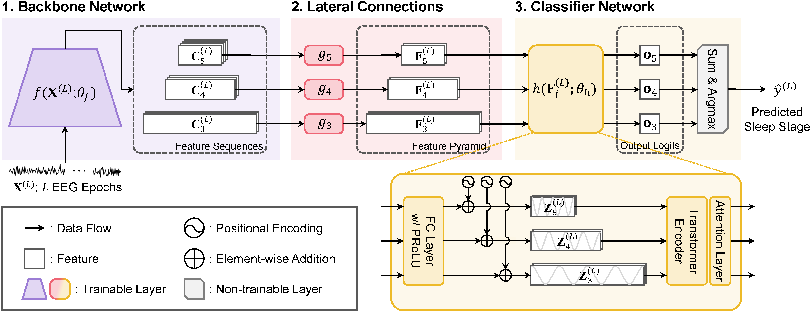
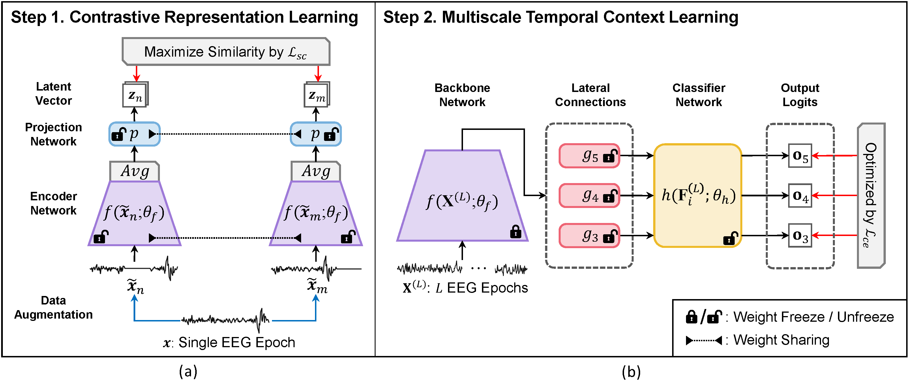

# LKSleepNet

By Zhe Liu

This repo is the official implementation of "***SleePyCo: Automatic Sleep Scoring with Feature Pyramid and Contrastive Learning***", accepted to ***Expert Systems With Applications (I.F. 8.5)***.

[[Paper](https://doi.org/10.1016/j.eswa.2023.122551)]

## Model Architecture

## Training Framework

## Main Results
|   **Dataset**  | **Subset** | **Channel** | **ACC** | **MF1** | **Kappa** | **W** | **N1** | **N2** | **N3** | **REM** | **Checkpoints** |
|:--------------:|:----------:|:-----------:|:-------:|:-------:|:---------:|:-----:|:------:|:------:|:------:|:-------:|:---------------:|
| Sleep-EDF-2013 |     SC     |    Fpz-Cz   |   86.8  |   81.2  |   0.820   |  91.5 |  50.0  |  89.4  |  89.0  |   86.3  | [Link](https://drive.google.com/file/d/1oUs8S9dVwmTJi9t9zh7msmJT_B28OpbP/view?usp=sharing) |
| Sleep-EDF-2018 |     SC     |    Fpz-Cz   |   84.6  |   79.0  |   0.787   |  93.5 |  50.4  |  86.5  |  80.5  |   84.2  | [Link](https://drive.google.com/file/d/1RdWl9AUMkFlNwUE2qxx3v5XcL3Exs0Pk/view?usp=sharing) |
|      MASS      |   SS1-SS5  |    C4-A1    |   86.8  |   82.5  |   0.811   |  89.2 |  60.1  |  90.4  |  83.8  |   89.1  | [Link](https://drive.google.com/file/d/16kPPhW04g5swGQeOJs8aRJOI13wSEKhI/view?usp=sharing)                 |
|   Physio2018   |      -     |    C3-A2    |   80.9  |   78.9  |   0.737   |  84.2 |  59.3  |  85.3  |  79.4  |   86.3  | [Link](https://drive.google.com/file/d/1r4NXeSzmP5rp_WTTGxiwHLGzknjPV8PT/view?usp=sharing) |
|      SHHS      |   shhs-1   |    C4-A1    |   87.9  |   80.7  |   0.830   |  92.6 |  49.2  |  88.5  |  84.5  |   88.6  | [Link](https://drive.google.com/file/d/1FwjtO3JLd1Di0yRmz7g4B0niyY0gzQEd/view?usp=sharing) |
